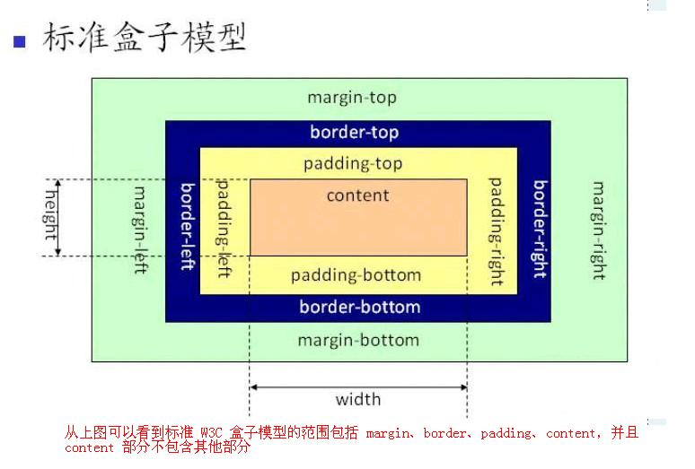

- [HTML](#HTML)
  - [1. 列举行内元素、块级元素、空元素（void）](#1-列举行内元素块级元素空元素void)
  - [2. 元素之间的转换](#2-元素之间的转换)
  - [3. 引入样式时`link`和`@import`有什么区别](#3-引入样式时link和import有什么区别)
  - [4. `title`和`h1`的区别、`b`与`strong`的区别、`i`与`em`的区别](#4-title和h1的区别b与strong的区别i与em的区别)
  - [5. `img`标签中的`title`和`alt`有什么区别](#5-img标签中的title和alt有什么区别)
  - [6. 常用图片格式](#6-常用图片格式)
- [CSS](#CSS)
  - [1. 盒子模型](#1-盒子模型)
  - [2. `height`和`line-height`的区别](#2-height和line-height的区别)
  - [3. 选择器、优先级、权重](#3-选择器优先级权重)
  - [4. 可继承属性、不可继承属性](#4-可继承属性不可继承属性)
  - [5. 清除浮动](#5-清除浮动)
  - [6. 网页中使用奇数还是偶数的字体？为什么？](#6-网页中使用奇数还是偶数的字体为什么)
  - [7. `position`的值及其作用](#7-position的值及其作用)
  - [8. 画三角形](#8-画三角形)
  - [9. 一个盒子不给宽高如何水平垂直居中](#9-一个盒子不给宽高如何水平垂直居中)
  - [10. 写一个左中右布局占满屏幕](#10-写一个左中右布局占满屏幕其中左右俩块固定宽-200中间自适应宽要求先加载中间块请写出结构及样式)
  - [11. 什么是`css reset`](#11-什么是css-reset)
  - [12. `css sprite`是什么，优缺点如何](#12-css-sprite是什么优缺点如何)
  - [13. `display: none;`与`visibility: hidden;`的区别](#13-display-none与visibility-hidden的区别)
  - [14. `opacity`和`rgba`的区别](#14-opacity和rgba的区别)
- [H5C3](#H5C3)
  - [1. 语义化标签](#1-语义化标签)
  - [2. 伪类、伪元素](#2-伪类伪元素)
  - [3. 如何关闭 iOS 键盘首字母自动大写](#3-如何关闭-ios-键盘首字母自动大写)
  - [4. 怎么让 Chrome 支持小于`12px`的文字](#4-怎么让-chrome-支持小于12px的文字)
  - [5. `rem` `em`](#5-rem-em)
  - [6. 响应式](#6-响应式)
  - [7. 布局方案](#7-布局方案)
- [JavaScript](#JavaScript)
  - [1. 延迟加载 js 的方式](#1-延迟加载-js-的方式)
  - [2. 数据类型](#2-数据类型)
  - [3. `undefined`和`null`的区别](#3-undefined和null的区别)
  - [4. `==`和`===`的区别](#4-和的区别)
  - [5. 宏任务和微任务](#5-宏任务和微任务)
  - [6. 作用域](#6-作用域)
  - [7. 对象](#7-对象)
  - [8. js 判断数组的方法](#8-js-判断数组的方法)
  - [9. `slice`和`splice`](#9-slice和splice)
  - [10. 数组去重](#10-数组去重)
  - [11. `new`操作符具体做了什么](#11-new操作符具体做了什么)
  - [12. 闭包](#12-闭包)
  - [13. 原型链](#13-原型链)
  - [14. 继承](#14-继承)
  - [15. apply bind call](#15-apply-bind-call)
  - [16. sort](#16-sort)
  - [17. 深拷贝和浅拷贝](#17-深拷贝和浅拷贝)
  - [18. `localStorage` `sessionStorage` `cookie`](#18-localstorage-sessionstorage-cookie)
- [ES6](#ES6)
  - [1. `var` `let` `const`](#1-var-let-const)
  - [2. 对象合并](#2-对象合并)
  - [3. 箭头函数和普通函数](#3-箭头函数和普通函数)
  - [4. `find` `filter`](#4-find-filter)
  - [5. `some` `every`](#5-some-every)
- [Vue](#Vue)
  - [1. 生命周期](#1-生命周期)
    - [1.1 有哪些生命周期](#11-有哪些生命周期)
    - [1.2 进入页面或者组件会执行哪些声明周期](#12-进入页面或者组件会执行哪些声明周期)
    - [1.3 哪个阶段有`$el`，哪个阶段有`$data`](#13-哪个阶段有el哪个阶段有data)
    - [1.4 keep-alive](#14-keep-alive)
  - [2. v-if v-show](#2-v-if-v-show)
  - [3. v-if v-for 优先级](#3-v-if-v-for-优先级)
  - [4. scoped](#4-scoped)
  - [5. Vue 样式穿透](#5-vue-样式穿透)
  - [6. 组件间通信](#6-组件间通信)
  - [7. computed methods watch](#7-computed-methods-watch)
  - [8. props 和 data 的优先级](#8-props-和-data-的优先级)
  - [9. Vuex](#9-vuex)
  - [10. Vue 设置代理](#10-vue-设置代理)
  - [11. Vue 项目打包上线](#11-vue-项目打包上线)
  - [12. SPA](#12-spa)
  - [13 路由](#13-路由)
  - [14. 双向绑定的原理](#14-双向绑定的原理)
  - [15. nextTick](#15-nexttick)
  - [16. diff 算法](#16-diff-算法)
  - [17. MVVM](#17-mvvm)

# HTML

## 1. 列举行内元素、块级元素、空元素（void）

- 行内元素：span img input
- 块级元素：div p h1-h6 header footer section
- 空元素：br hr

## 2. 元素之间的转换

| display                | 作用                     | 特性                     |
| ---------------------- | ------------------------ | ------------------------ |
| display: inline;       | 把某元素转换为行内元素   | 不独占一行，不能设置宽高 |
| display: inline-block; | 把某元素转换为行内块元素 | 不独占一行，可以设置宽高 |
| display: block;        | 把某元素转换为块元素     | 独占一行，可以设置宽高   |

## 3. 引入样式时`link`和`@import`有什么区别

- 先有`link`，后有`@import`，`link`的兼容性比`@import`好
- 加载顺序有差别，浏览器先加载`link`，后加载`@import`

## 4. `title`和`h1`的区别、`b`与`strong`的区别、`i`与`em`的区别

- `title`概括了网站信息，告诉搜索引擎/用户网站的内容主题，`h1`是文章主题内容，告诉爬虫网站内容主要是什么
- `title`显示在网页标题上，`h1`显示在网页内容里
- `title`比`h1`重要，SEO
- 网站的 logo 都是用`h1`标签包裹的

---

- `b`是实体标签，用于文字加粗；`strong`是逻辑标签，用于加强字符语气
- `b`只有加粗样式，无实际意义；`strong`表示标签内文字比较重要，用以强调
- 为符合 CSS3 的规范，`b`尽量少用

---

- `i`是实体标签，用于文字倾斜；`em`是逻辑标签，用于强调文字内容
- `i`只有倾斜样式，无实际意义；`em`表示标签内文字比较重要，用以强调
- `i`更多的用在字体图标；`em`用于文章中的一些术语

## 5. `img`标签中的`title`和`alt`有什么区别

- `title`是鼠标移入到图片显示的值；`alt`是图片无法加载时显示的值
- 在 SEO 的层面上，爬虫抓取不到图片的内容，所以前端在写`img`标签时为了利于 SEO 要加入`alt`属性来描述图片的内容/关键词

## 6. 常用图片格式

- `png` 无损压缩，尺寸体积比`jpg/jpeg`大，适合做小图标
- `jpg` 采用压缩算法，有一点失真，比`png`体积小，适合中大图片
- `gif` 动图
- `webp` 同时支持有损/无损压缩，相同质量的图片`webp`具有更小的体积，但是兼容性不是特别好

# CSS

## 1. 盒子模型

- 标准盒子模型：margin border padding content
- IE 盒子模型：margin content(border+padding+content)

```css
box-sizing: content-box; /* 标准盒子模型 */
box-sizing: border-box; /* IE盒子模型 */
```




## 2. `height`和`line-height`的区别

- `height`是盒子的高度
- `line-height`是每一行文字的高，如果文字换行则整个盒子高度会增大（行数\*行高）

## 3. 选择器、优先级、权重

- 通配 id 类 标签 属性 相邻 后代 子代
- !important > 内联样式 > id > class > 标签 > 通配
- 权重 (a, b, c)
  - a id 选择器的个数
  - b 类、伪类、属性选择器的个数
  - c 元素、伪元素选择器的个数

## 4. 可继承属性、不可继承属性

- 可继承：文字系列（font-size color line-height text-align）
- 不可继承：border padding margin

## 5. 清除浮动

1. 触发`BFC`
2. 多创建一个盒子，添加样式`clear: both;`
3. 伪类

```css
ul:after {
  content: "";
  display: block;
  clear: both;
}
```

## 6. 网页中使用奇数还是偶数的字体？为什么？

- 偶数，让文字在浏览器上表现更好看
- UI 给前端的设计图一般都是偶数的，这样不管是布局还是转换 px 都方便

## 7. `position`的值及其作用

| position | 作用                                                     |
| -------- | -------------------------------------------------------- |
| static   | 默认值，没有定位                                         |
| fixed    | 固定定位，相对于浏览器窗口进行定位                       |
| relative | 相对定位，相对于自身定位，不脱离文档流                   |
| absolute | 绝对定位，相对于第一个 relative 的父元素定位，脱离文档流 |

`relative`和`absolute`的区别：

1. `relative`不脱离文档流；`absolute`脱离文档流
2. `relative`相对于自身进行定位；`absolute`相对于第一个 relative 的父元素进行定位

## 8. 画三角形

```css
width: 0;
height: 0;
border-left: 100px solid transparent;
border-right: 100px solid transparent;
border-top: 100px solid transparent;
border-bottom: 100px solid #ccc;
```

## 9. 一个盒子不给宽高如何水平垂直居中

```css
/* 1. flex布局 */
.father {
  display: flex;
  justify-content: center;
  align-items: center;
  width: 300px;
  height: 300px;
  border: 5px solid #ccc;
}
.son {
  background: red;
}
/* 2. 定位+位移 */
.father1 {
  position: relative;
  width: 300px;
  height: 300px;
  border: 5px solid #ccc;
}
.son1 {
  position: absolute;
  left: 50%;
  top: 50%;
  background: red;
  transform: translate(-50%, -50%);
}
```

## 10. 写一个左中右布局占满屏幕，其中左、右俩块固定宽 200，中间自适应宽，要求先加载中间块，请写出结构及样式

## 11. 什么是`css reset`

- reset.css 用于重置 CSS 默认样式
- normalize.css 为了增强跨浏览器渲染的一致性，一个 CSS 重置样式库

## 12. `css sprite`是什么，优缺点如何

- 是雪碧图，把多个小图片合并成一张大图片
- 优点：减少了 http 请求的次数，提升了性能
- 缺点：维护比较差（例如图片位置进行修改或者内容宽高修改）

## 13. `display: none;`与`visibility: hidden;`的区别

- `display: none;`不占位；`visibility: hidden;`占位
- `display: none;`产生重绘和一次回流；`visibility: hidden;`产生重绘
  - 产生回流一定会造成重绘，但是重绘不一定会造成回流
  - 产生回流的情况：改变元素的位置(left、top...)、显示隐藏元素...
  - 产生重绘的情况：样式改变、换皮肤


## 14. `opacity`和`rgba`的区别

- 共同点：都能实现透明效果
  - `opacity`取值范围 0 到 1 之间，0 表示完全透明，1 表示不透明
  - `rgba`R 表示红色，G 表示绿色，B 表示蓝色，取值可以在正整数或者百分数。A 表示透明度取值 0 到 1 之间
- 区别：继承
  - `opacity`会继承父元素的`opacity`属性，而`rgba`设置的元素的后代元素不会继承不透明属性

# H5C3

## 1. 语义化标签

- 易读性和维护性更好
- 利于 SEO，爬虫抓取
- IE8 不兼容 H5 标签，解决办法：`html5shiv.js`

## 2. 伪类、伪元素

1. `:`是伪类 `::`是伪元素
2. 作用：清除浮动、样式布局...

## 3. 如何关闭 iOS 键盘首字母自动大写

```html
<input type="text" autocapitalize="off" />
```

## 4. 怎么让 Chrome 支持小于`12px`的文字

缩放，Chrome 默认字体大小是`16px`

## 5. `rem` `em`

`em`相对于父元素的`font-size` `rem`相对于根(html)元素的`font-size`

## 6. 响应式

1. 响应式指一个 URL 可以响应多端
2. 语法是媒体查询

- only 可以排除不支持媒体查询的浏览器
- screen 设备类型
- max-width max-height
- min-width min-height

```css
@media only screen and (max-width: 1000px) {
  ul li:last-child {
    display: none;
  }
}
```

3. 响应式图片

```html
<picture>
  <source srcset="1.jpg" media="(min-width:1000px)" />
  <source srcset="2.jpg" media="(min-width:700px)" />
  
</picture>
```

## 7. 布局方案

1. 什么情况下采用响应式布局

- 数据不是特别大，用户量不是特别大，纯展示类的项目适合响应式布局
- 例如：公司官网、专题页面
- 特别追求性能的项目不适合响应式，因为如果添加了很多的响应式就会造成加载速度变慢

2. PC+移动端采用什么布局方案

- PC 是一套，加入一点点响应式
- 移动端是一套，使用自适应的布局

# JavaScript

## 1. 延迟加载 js 的方式

- 延迟加载 async defer
- `defer`是等`html`全部解析完成才会执行 js 代码，顺次执行 js 脚本
- `async`和`html`解析同步，不是顺次执行 js 脚本（谁先加载完谁先执行）
- eg: `<script defer type="text/javascript" src='script.js'></script>`

## 2. 数据类型

- 基本数据类型：string、number、boolean、undefined、null、symbol、bigint
- 引用数据类型：object

## 3. `undefined`和`null`的区别

- 作者在设计 js 时先设计了`null`（为什么设计`null`：最初设计 js 时借鉴了 java）
- `null`会被隐式转换为 0，不容易发现错误
- `null`是一个表示无的对象（空对象指针），转为数值时为 0
- `undefined`是一个表示无的原始值，转为数值时为`NaN`

## 4. `==`和`===`的区别

- `==`比较的是值，会隐式转换（通过`valueOf`）
- `===`除了比较值，还比较类型


## 5. 宏任务和微任务

1. js 是单线程的语言
2. js 代码执行流程：

- 同步代码
- 事件循环（请求、定时器、事件...）
- 同步的任务都执行完了，才会执行事件循环的内容

3. 事件循环中包含宏任务和微任务

- 宏任务：`setTimeout`
- 微任务：`promise.then`
- 执行宏任务的前提是清空了所有的微任务

4. 流程：同步-->事件循环（微任务和宏任务）-->微任务-->宏任务-->微任务...

## 6. 作用域

1. 除了函数外 js 没有块级作用域
2. 作用域链：内部可以访问外部的变量，但是外部不能访问内部的变量（如果内部有，优先查找到内部，如果内部没有就查找外部的）
3. js 有变量提升的机制
4. 优先级：声明变量 > 声明普通函数 > 参数 > 变量提升

## 7. 对象

1. 对象是通过`new`操作符构建出来的，所以对象之间不相等（除了引用）
2. 对象是引用类型
3. 对象的`key`都是字符串类型
4. 对象查找属性/方法：对象本身 --> 构造函数 --> 对象原型 --> 构造函数原型 --> 对象上一层原型

## 8. js 判断数组的方法

1. `Array.isArray`
2. `arr instanceof Array`
3. `Object.prototype.toString.call(arr).indexOf('Array') > -1`
4. `Array.prototype.isPrototypeOf(arr)`
5. `arr.constructor.toString().indexOf('Array') > -1`

## 9. `slice`和`splice`

- `slice`用于截取数组，不改变原数组，返回新数组
- `splice`的功能有插入、删除、替换，会改变原数组，返回的是删除的元素

## 10. 数组去重

1. `[...new Set(arr)]`
2. 遍历，`indexOf`
3. `sort`

## 11. `new`操作符具体做了什么

1. 创建一个空对象
2. 将空对象的原型指向构造函数的原型
3. 将空对象作为构造函数的上下文（改变 this 指向）
4. 对构造函数有返回值的处理判断

```js
function Fun(age, name) {
  this.age = age;
  this.name = name;
}
function create(fn, ...args) {
  //1. 创建了一个空的对象
  var obj = {}; //var obj = Object.create({})
  //2. 将空对象的原型，指向于构造函数的原型
  Object.setPrototypeOf(obj, fn.prototype);
  //3. 将空对象作为构造函数的上下文（改变this指向）
  var result = fn.apply(obj, args);
  //4. 对构造函数有返回值的处理判断
  return result instanceof Object ? result : obj;
}
console.log(create(Fun, 18, "张三"));
```

## 12. 闭包

1. 闭包是一个函数加上到创建函数的作用域的连接，闭包“关闭”了函数的自由变量
2. 闭包解决的问题：内部函数可以访问到外部函数的局部变量
3. 闭包的缺点：

- 变量会驻留在内存中，造成内存损耗问题（解决：将闭包的函数设置为`null`）
- 内存泄漏（IE）

## 13. 原型链

1. 原型链解决的问题：对象共享属性和方法
2. 谁有原型：

- 函数：`prototype`
- 对象：`__proto__`

3. 对象查找属性/方法的顺序：对象本身 --> 构造函数 --> 对象原型 --> 构造函数原型 --> 对象上一层原型
4. 原型链：就是把原型串联起来，原型链的最顶端是`null`

## 14. 继承

**方式一：ES6**

```js
class Parent {
  constructor() {
    this.age = 18;
  }
}

class Child extends Parent {
  constructor() {
    super();
    this.name = "张三";
  }
}
let o1 = new Child();
console.log(o1, o1.name, o1.age);
```

**方式二：原型链继承**

```js
function Parent() {
  this.age = 20;
}
function Child() {
  this.name = "张三";
}
Child.prototype = new Parent();
let o2 = new Child();
console.log(o2, o2.name, o2.age);
```

**方式三：借用构造函数继承**

```js
function Parent() {
  this.age = 22;
}
function Child() {
  this.name = "张三";
  Parent.call(this);
}
let o3 = new Child();
console.log(o3, o3.name, o3.age);
```

**方式四：组合式继承**

```js
function Parent() {
  this.age = 100;
}
function Child() {
  Parent.call(this);
  this.name = "张三";
}
Child.prototype = new Parent();
let o4 = new Child();
console.log(o4, o4.name, o4.age);
```

## 15. apply bind call

- 共同点：都可以改变`this`指向
- 不同点：
  - `call`、`apply`可以立即执行；`bind`不会立即执行，因为`bind`返回的是一个函数需要加入()执行
  - `apply`第二个参数是数组。`call`和`bind`有多个参数需要挨个写

**使用场景**

```js
// 1. 用apply的情况
var arr1 = [1, 2, 4, 5, 7, 3, 321];
console.log(Math.max.apply(null, arr1));

// 2. 用bind的情况
var btn = document.getElementById("btn");
var h1s = document.getElementById("h1s");
btn.onclick = function () {
  console.log(this.id);
}.bind(h1s);
```

## 16. sort

- `V8`引擎`sort`函数只给出了两种排序`InsertionSort`和`QuickSort`
- 数量小于 10 的数组使用`InsertionSort`，数量大于 10 的数组则使用`QuickSort`
- 插入排序和快排，现在是冒泡
- 原理实现链接：https://github.com/v8/v8/blob/ad82a40509c5b5b4680d4299c8f08d6c6d31af3c/src/js/array.js
- 710 行代码开始

## 17. 深拷贝和浅拷贝

1. 浅拷贝只复制引用，未复制真正的值

- `Object.assign`
- 扩展运算符

2. 深拷贝是复制真正的值

- 手写递归
- `JSON.parse()` `JSON.stringify()`

```js
// 手写递归实现
function deepClone(obj) {
  if (Array.isArray(obj)) {
    let newObj = [];
  } else {
    let newObj = {};
  }
  for (let key in obj) {
    if (typeof obj[key] === "object") {
      newObj[key] = deepClone(obj[key]);
    } else {
      newObj[key] = obj[key];
    }
  }
  return newObj;
}
```

## 18. `localStorage` `sessionStorage` `cookie`

共同点：在客户端存放数据
不同点：

1. 数据存放有效期

- `localStorage` 始终有效，窗口或浏览器关闭了也一直保存，是持久化存储
- `sessionStorage` 仅在当前浏览器窗口关闭之前有效，关闭就没了
- `cookie` 只在设置的`cookie`过期时间之前有效，即使窗口或浏览器关闭了也有效

2. 过期时间

- `cookie` 过期时间，可以设置过期（把时间调整到之前的时间，就过期了）
- `localStorage` `sessionStorage` 不能设置过期时间

3. 存储大小的限制

- `cookie` 存储量不能超过 `4k`
- `localStorage` `sessionStorage` 不能超过 `5M`
- 注：不同浏览器存储大小也有不同

# ES6

## 1. `var` `let` `const`

1. `var`有变量提升的机制 `let` `const`没有变量提升
2. `var`可以多次声明同一个变量 `let` `const`不可以
3. `var` `let`声明变量，可再次赋值 `const`声明常量，不能再次赋值，且必须初始化
4. `var`声明的变量没有自身作用域 `let` `const`声明的变量有自身的作用域

## 2. 对象合并

1. `Object.assign`
2. 扩展运算符
3. 手动封装

```js
// 对象合并
function merge(target, source) {
  for (let key in source) {
    target[key] = source[key];
  }
  return target;
}
```

## 3. 箭头函数和普通函数

1. `this`指向：箭头函数没有自己的`this`，其`this`指向定义时外层第一个普通函数的`this`，不可修改
2. 箭头函数不能`new`（不能作为构造函数）
3. 没有`arguments`
4. 没有`prototype`

## 4. `find` `filter`

1. 返回的内容不同

- `find` 返回具体的内容
- `filter` 返回新数组

2. 匹配

- `find` 匹配到第一个即返回
- `filter` 返回整体（没一个匹配到的都返回）

## 5. `some` `every`

`some`有一项匹配即返回`true` `every`全部匹配才返回`true`

# Vue

## 1. 生命周期

### 1.1 有哪些生命周期

beforeCreate、created、beforeMount、mounted、beforeUpdate、updated、beforeDestroy、destroyed
加入`keep-alive`后多两个：activated、deactivated

### 1.2 进入页面或者组件会执行哪些声明周期

- beforeCreate、created、beforeMount、mounted
- 加入`keep-alive`：beforeCreate、created、beforeMount、mounted、activated
- 加入`keep-alive`，第二次或者第 N 次进入组件只执行一个生命周期：activated

### 1.3 哪个阶段有`$el`，哪个阶段有`$data`

1. beforeCreate 都没有
2. created 有`$data` 没有`$el`
3. beforeMount 有`$data` 没有`$el`
4. mounted 都有

### 1.4 keep-alive

1. 是 Vue 系统自带的一个组件，是来缓存组件的（提升性能）
2. 使用场景：缓存组件，提升项目的性能

- 具体实现比如：首页进入到详情页，如果用户在首页每次点击都是相同的，那么详情页就没必要请求 N 次了，直接缓存起来就可以了，当然如果点击的不是同一个，那么就直接请求

## 2. v-if v-show

1. 原理不同

- v-if 创建一个 DOM 节点
- v-show 是 display none/block

2. 使用场景不同

- 初次加载 v-if 要比 v-show 好
- 频繁切换 v-show 要比 v-if 好，创建和删除的开销太大了，显示和隐藏开销较小

## 3. v-if v-for 优先级

v-for 的优先级要比 v-if 高
证明这个事情，是在 vue.js 源码种 10997 行
v-if 和 v-for 不要写在同一个节点上，这个性能很差（v-if 要写在父节点上）

```js
if (el.staticRoot && !el.staticProcessed) {
  return genStatic(el, state);
} else if (el.once && !el.onceProcessed) {
  return genOnce(el, state);
} else if (el.for && !el.forProcessed) {
  return genFor(el, state);
} else if (el.if && !el.ifProcessed) {
  return genIf(el, state);
} else if (el.tag === "template" && !el.slotTarget && !state.pre) {
  return genChildren(el, state) || "void 0";
} else if (el.tag === "slot") {
  return genSlot(el, state);
} else {
}
```

## 4. scoped

1. 作用：让样式在本组件中生效，不影响其他组件
2. 原理：给节点新增自定义属性，然后 css 根据属性选择器添加样式

## 5. Vue 样式穿透

- stylus 样式穿透使用 >>>
- sass 和 less 使用 /deep/
- 通用使用 v-deep

## 6. 组件间通信

## 7. computed methods watch

1. [computed VS methods] computed 有缓存 methods 没有缓存
2. computed VS watch

- computed 计算某一个属性的改变，如果某一个值改变，计算属性监听到进行返回
- watch 是监听，数据或者路由发生了改变才可以响应
- watch 是当前监听到数据改变了才会执行内部代码

## 8. props 和 data 的优先级

props --> methods --> data --> computed --> watch

## 9. Vuex

### 9.1 Vuex 包含什么内容

- state 类似于组件中 data，存放数据
- getters 类型于组件中 computed
- mutations 类似于组件中 methods
- actions 提交 mutations 的
- modules 把以上 4 个属性再细分，让仓库更好管理

### 9.2 Vuex 是单向数据流

### 9.3 mutaitons 和 actions 区别

- mutaitons：都是同步事物
- actions：可以包含任意异步操作

### 9.4 Vuex 如何做持久化存储

Vuex 本身不是持久化存储，

1. 使用 localStorage 自己写
2. 使用 vuex-persist 插件

## 10. Vue 设置代理

```js
// vue.config.js
module.exports = {
  publicPath: "./",
  devServer: {
    proxy: "http://localhost:3000",
  },
};
```

## 11. Vue 项目打包上线

1. 自测，修改路由模式
2. 代理不生效，使用 ENV
3. 修改路径

## 12. SPA

- 单页面应用的意思是：一个系统只加载一次资源，之后的操作交互和数据交互是通过路由、Ajax 来进行的，页面并没有刷新
- SPA 是单页面应用，缺点：不利于 SEO、性能不是特别好
- SPA 跳转是一个页面进行切换；传统页面跳转是跳转不同的 HTML
- SPA 对于 SEO 不好，只能收录一个；传统的页面对于 SEO 比较好，多个 HTML 文件收录

## 13 路由

### 13.1 Vue-Router 是什么？原理是什么？

### 13.2 $route 和 $router

#### 1> 概述

|      | $route                                           | $router                                       |
| ---- | ------------------------------------------------ | --------------------------------------------- |
| 含义 | 当前活跃路由的对象，包含与路由相关的信息（只读） | 路由实例对象，包含全局路由配置和导航的方法    |
| 类型 | 是一个路由对象，表示当前路由的状态和信息         | 是`VueRouter`类的实例，负责管理路由和执行跳转 |
| 功能 | 提供当前路由的路径、参数、查询等信息             | 提供`push`、`replace`等路由导航的方法         |

#### 2> 用法和属性

`$route`是当前路由对象，包含当前路由的信息（只读）

| 参数                  | 含义                                    |
| --------------------- | --------------------------------------- |
| `this.$route.path`    | 当前路由的路径，例如`'/home'`           |
| `this.$route.query`   | 查询参数，例如`{ id: 123 }`             |
| `this.$route.params`  | 动态路由参数，例如`{ id: 123 }`         |
| `this.$route.name`    | 当前路由的名称，例如`'home'`            |
| `this.$route.meta`    | 路由元信息，例如`{ requireAuth: true }` |
| `this.$route.matched` | 当前路由匹配的路有记录数组              |

`$router`是`VueRouter`是实例，包含全局路由配置和导航相关的方法

| 方法         | 含义                     | 实例                                                            |
| ------------ | ------------------------ | --------------------------------------------------------------- |
| `push`       | 添加一个新的路由到历史栈 | `this.$router.push('./home')` 跳转到`home`                      |
| `replace`    | 替换当前路由             | `this.$router.replace('/about')` 替换当前路由为`about`          |
| `go`         | 在浏览历史中前进或后退   | `this.$router.go(-1)` 返回上一个页面                            |
| `beforeEach` | 注册全局路由守卫         | `this.$router.beforeEach((to, from, next) => { ...; next(); })` |

### 路由懒加载的三种方式

#### 1> Vue 异步组件

`Vue-router`配置路由，使用`Vue`的异步组件技术，可以实现按需加载

```js
// router.js
{
  path: '/home',
  name: 'home',
  component: resolve => require(['@/components/home'], resolve)
}, {
  path: '/index',
  name: 'index',
  component: resolve => require(['@/components/index'], resolve)
}, {
  path: '/about',
  name: 'about',
  component: resolve => require(['@/components/about'], resolve)
}
```

#### 2> 路由懒加载（使用 import）

```js

```

### 12.1 路由模式

- 两种路由模式：history hash
- URL 不同
  - hash http://localhost:8080/#/about
  - history http://localhost:8080/about
- 跳转请求
  - history http://localhost:8080/id 发送请求
  - hash 不会发送请求
- 打包后前端自测要使用 hash，如果使用 history 会出现空白页

### 12.2 路由传参

1. 显式（query）http://localhost:8080/about?a=1

```js
// 传
this.$router.push({
  path: "/about",
  query: {
    a: 1,
  },
});
// 接
this.$route.query.a;
```

2. 隐式（params）http://localhost:8080/about

```js
// 传
this.$router.push({
  name: "About",
  params: {
    a: 1,
  },
});
// 接
this.$route.params.a;
```

### 12.3 路由导航守卫

1. 全局路由守卫 beforeEach、beforeResolve、afterEach
2. 路由独享守卫 beforeEnter
3. 组件内路由守卫 beforeRouteEnter、beforeRouteUpdate、beforeRouteLeave

### 12.4 动态路由

场景：详情页(文章、商品)

```js
// router.js
{
  path: '/list',
  name: 'List',
  children: [{
    path: '/list/:id',
    name: 'Details',
    component: () => import('../views/Details.vue')
  }],
  component: () => import('../views/List.vue')
}
```

## 14. 双向绑定的原理

通过`Object.defineProperty`劫持数据发生的改变，如果数据发生改变了（在 set 中进行赋值的），触发 update 方法进行更新节点内容（{{ str }}），从而实现了数据双向绑定的原理

## 15. nextTick

- 作用：当 DOM 更新完毕执行内部代码
- 场景：使用插件的时候会用到。例如 new Swiper 这个插件可能会获取当前元素的宽度或者高度，等 DOM 都加载完毕再去获取宽度和高度就不会有任何问题了

## 16. diff 算法

- 功能：提升性能
- 虚拟 DOM，其实就是数据，把 DOM 数据化

#### 16.1 主流：snabbdom、virtual-dom

https://www.npmjs.com/package/snabbdom

#### 16.2 搭建环境

```bash
npm init -y
cnpm install webpack@5 webpack-cli@3 webpack-dev-server@3 -S
cnpm install snabbdom -S
新建webpack.config.js
配置webpack.config.js
```

#### 16.3 虚拟节点和真实节点

**虚拟节点**

```js
{
  children: undefined,
  data: {},
  elm: h1,
  key: undefined,
  sel: 'h1',
  text: '你好h1'
}
```

**真实节点**

```html
<h1>你好h1</h1>
```

#### 16.4 新老节点替换的规则

1. 如果新老节点不是同一个节点名称，那么就暴力删除旧的节点，创建插入新的节点
2. 只能同级比较，不能跨层比较。如果跨层那么就暴力删除旧的节点，创建插入新的节点
3. 如果是相同节点，又分为很多情况

- 新节点没有 children
  - 如果新的节点没有 children，那就证明新节点是文本，那直接把旧的替换成新的文本
- 新节点有 children
  - 新的有 children，旧的没有 ---> 创建元素添加（把旧的内容删除清空掉，增加新的）
  - 新的有 children，旧的也有 children ---> **diff 算法的核心**

**diff 算法的核心**

```
diff算法的核心（最复杂的情况）
1、 旧前 和 新前
		匹配：旧前的指针++ 、 新前的指针++
2、 旧后 和 新后
		匹配：旧后的指针-- 、 新后的指针--
3、 旧前 和 新后
		匹配：旧前的指针++ 、 新后的指针--
4、 旧后 和 新前
		匹配：旧后的指针-- 、 新前的指针++
5、 以上都不满足条件 ---> 查找
		新的指针++，新的添加到页面上并且新在旧的种有，要给旧的复制成undefined
6、 创建或者删除
```

注：如果要提升性能，一定要加入 key，key 是唯一标示，在更改前后，确认是不是同一个节点

## 17. MVVM

### 17.1 web 1.0

- 文件全在一起，也就是前端和后端的代码全在一起
- 问题：
  - 前端和后端都是一个人开发（技术没有侧重点或者责任不够细分）
  - 项目不好维护
  - html、css、js 页面的静态内容没有，后端是没办法工作的（没办法套数据）
- mvc....都是后端先出的

### 17.2 web 2.0

- ajax 出现了，就可以：前端和后端数据分离了
- 解决问题：后端不用等前端页面弄完没，后端做后端的事情（写接口）、前端布局、特效、发送请求
- 问题：html、css、js 都在一个页面中，单个页面可能内容也是比较多的（也会出现不好维护的情况）

### 17.3 出现前端的框架了 MVC、MVVM

解决问题：可以把一个“特别大”页面，进行拆分（组件化），单个组件进行维护

### 17.4 MVVM

​- Model-View-ViewModel 的简写

- view : 视图【dom==》在页面中展示的内容】
- model：模型【数据层：vue 中的 data 数据】
- viewModel：视图模型层【就是 vue 源码】


# 性能优化

## 1. 加载优化

## 2. 图片优化

## 3. 渲染优化

## 4. 首屏优化

## 5. Vue 优化

# 兼容

## 1. 页面样式兼容

## 2. 框架兼容

# 计算机网络

## 1. 跨域

## 2. http https

# 网络安全

## 1. XSS

## 2. SQL 注入

## 3. 接口安全

# 其它

## 1. token

## 2. SEO
